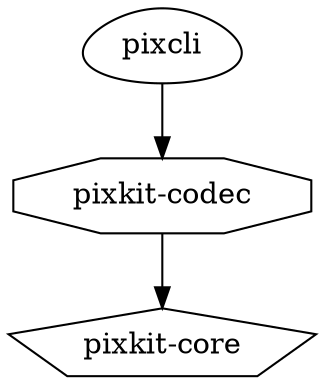

# 第6章　ターゲットとプロパティ

## この章のゴール

- CMakeにおける「ターゲット」が何であるかを説明できる
- `target_*` コマンドで設定をターゲットに結びつけられる
- **`PUBLIC` / `PRIVATE` / `INTERFACE` を正しく使い分けられる**
- なぜ `include_directories` を使ってはいけないのかを、自分の言葉で言える
- `ALIAS` と `名前空間::` 命名規約の意味を理解する
- 依存グラフを可視化して確認できる

**本書で最も重要な章はここだ。** 第9章以降で3種類のライブラリを作るとき、テストを組み込むとき、パッケージを配布するとき、すべての土台になるのがこの章の内容である。逆に言えば、ここさえ理解すれば残りは応用にすぎない。

---

## 6.1　ターゲットという単位

### ターゲットとは何か

CMakeにおけるターゲットとは、**ビルドの成果物と、それを作るために必要なすべての情報をまとめた単位**だ。「`pixkit-codec` という静的ライブラリを作る。ソースはこれで、インクルードパスはこれで、こういうマクロが必要で、これに依存している」という情報の束である。

第1章4節で述べた「モダンCMake」とは、要するに**すべての設定をターゲットに結びつける**書き方のことだ。

### ターゲットの種類

```cmake
# 実行ファイル
add_executable(pixcli src/main.cpp)

# ライブラリ
add_library(pixkit-codec  STATIC    src/ppm.cpp)   # 静的ライブラリ    → 第9章
add_library(pixkit-filter SHARED    src/blur.cpp)  # 動的ライブラリ    → 第11章
add_library(pixkit-core   INTERFACE)               # ヘッダーオンリー  → 第10章
add_library(pixkit-obj    OBJECT    src/util.cpp)  # オブジェクトライブラリ
add_library(plugin        MODULE    src/plugin.cpp)# 実行時ロード専用

# エイリアス（実体を持たない別名）
add_library(pixkit::codec ALIAS pixkit-codec)

# ビルド成果物を持たないターゲット
add_custom_target(docs COMMAND doxygen)
```

| 種類 | 生成物 | 主な用途 |
| --- | --- | --- |
| `STATIC` | `.lib` | 静的リンク。既定 |
| `SHARED` | `.dll` + インポート `.lib` | 動的リンク |
| `INTERFACE` | **なし** | ヘッダーオンリー、設定の束 |
| `OBJECT` | `.obj` の集合 | 同じソースを複数のライブラリに組み込みたいとき |
| `MODULE` | `.dll` | `LoadLibrary` で動的にロードするプラグイン |
| `ALIAS` | なし | 別名。実体は元のターゲット |

`STATIC` / `SHARED` を省略すると、変数 `BUILD_SHARED_LIBS` の値で決まる（第11章8節）。**明示するほうがよい**——と言いたいところだが、ライブラリ作者としては省略して `BUILD_SHARED_LIBS` に従わせるのが親切な場合もある。この判断は第11章で扱う。

### インポートターゲット

もう1種類、重要なものがある。**すでにビルド済みの、外部のライブラリを表すターゲット**だ。

```cmake
find_package(GTest CONFIG REQUIRED)
target_link_libraries(pixkit-tests PRIVATE GTest::gtest_main)
```

`GTest::gtest_main` は自分でビルドするターゲットではなく、「どこかにある `.lib` と、それを使うために必要な設定」をまとめたインポートターゲットだ。使う側から見れば、自作ターゲットとまったく同じように扱える。第18章で詳しく扱う。

---

## 6.2　`target_*` コマンド

ターゲットに設定を追加するコマンドは、名前が `target_` で始まる。よく使うものを挙げる。

```cmake
add_library(mylib STATIC src/mylib.cpp)

target_include_directories(mylib PUBLIC include)
target_compile_definitions(mylib PRIVATE MYLIB_INTERNAL=1)
target_compile_options    (mylib PRIVATE /W4)
target_compile_features   (mylib PUBLIC  cxx_std_23)
target_link_libraries     (mylib PUBLIC  otherlib)
target_link_options       (mylib PRIVATE /DEBUG)
target_sources            (mylib PRIVATE src/extra.cpp)
target_precompile_headers (mylib PRIVATE <vector> <string>)
```

| コマンド | 何を設定するか | コンパイラに渡るもの |
| --- | --- | --- |
| `target_include_directories` | インクルードパス | `/I` |
| `target_compile_definitions` | プリプロセッサ定義 | `/D` |
| `target_compile_options` | 任意のコンパイルフラグ | そのまま |
| `target_compile_features` | 必要な言語機能 | `/std:c++23` など（第7章） |
| `target_link_libraries` | リンクする相手 | `.lib` の指定 |
| `target_sources` | ソースファイルの追加 | — |

第2引数が必ず `PUBLIC` / `PRIVATE` / `INTERFACE` のいずれかであることに注目してほしい。これが次節のテーマだ。

> **`target_compile_definitions` の書き方**
> ```cmake
> target_compile_definitions(mylib PRIVATE FOO)          # /DFOO
> target_compile_definitions(mylib PRIVATE FOO=1)        # /DFOO=1
> target_compile_definitions(mylib PRIVATE -DFOO)        # /DFOO （-D は自動的に除去される）
> ```
> `-D` を付けても付けなくても同じ結果になる。付けないほうが読みやすい。

---

## 6.3　`PUBLIC` / `PRIVATE` / `INTERFACE` — 使用要件

### 3つのキーワードの意味

```cmake
target_include_directories(mylib
    PRIVATE   src        # mylib 自身のビルドにだけ使う
    PUBLIC    include    # mylib 自身にも使い、mylib を使う人にも渡す
    INTERFACE public_api # mylib 自身には使わず、mylib を使う人にだけ渡す
)
```

覚え方はこうだ。

| キーワード | 自分に適用 | 使う人に伝播 |
| --- | --- | --- |
| `PRIVATE` | ○ | × |
| `PUBLIC` | ○ | ○ |
| `INTERFACE` | × | ○ |

この「使う人に伝播する設定」を**使用要件（usage requirements）**と呼ぶ。

### 具体例で見る

```cmake
add_library(mathlib STATIC src/mathlib.cpp)

target_include_directories(mathlib
    PUBLIC  ${CMAKE_CURRENT_SOURCE_DIR}/include   # mathlib.hpp がここにある
    PRIVATE ${CMAKE_CURRENT_SOURCE_DIR}/src       # 内部ヘッダがここにある
)

target_compile_definitions(mathlib
    PUBLIC  MATHLIB_AVAILABLE=1      # 使う人にも知らせたい
    PRIVATE MATHLIB_BUILDING=1       # ビルド中だけの内部フラグ
)

add_executable(app src/main.cpp)
target_link_libraries(app PRIVATE mathlib)
```

この結果、`app` のコンパイル時には次が自動的に渡る。

```
/I<...>/include        ← mathlib の PUBLIC から
/DMATHLIB_AVAILABLE=1  ← mathlib の PUBLIC から
```

そして次は**渡らない**。

```
/I<...>/src            ← PRIVATE なので伝播しない
/DMATHLIB_BUILDING=1   ← PRIVATE なので伝播しない
```

`app` 側の `CMakeLists.txt` には `target_link_libraries(app PRIVATE mathlib)` の1行しか書いていない。**ライブラリが自分の使い方を知っていて、リンクした相手に自動的に伝える。** これが使用要件の威力だ。

### 何を PUBLIC にすべきか

判断基準は明快だ。**「そのライブラリの公開ヘッダをコンパイルするために必要か」**を考える。

```cpp
// include/mathlib/vector.hpp  ← 公開ヘッダ
#pragma once
#include <mathlib/config.hpp>   // これも公開ヘッダなので include/ が必要 → PUBLIC

#ifdef MATHLIB_USE_DOUBLE       // 利用側のコンパイルで評価される → PUBLIC
using scalar_t = double;
#else
using scalar_t = float;
#endif
```

```cpp
// src/vector.cpp  ← 実装ファイル
#include "internal/simd_helpers.hpp"   // 内部ヘッダ → PRIVATE
```

| 判断 | キーワード |
| --- | --- |
| 公開ヘッダが `#include` している → 利用側にもパスが要る | `PUBLIC` |
| 公開ヘッダの中の `#ifdef` で使う → 利用側でも定義が要る | `PUBLIC` |
| `.cpp` の中でしか使わない | `PRIVATE` |
| 公開ヘッダの中で型が現れる依存ライブラリ | `PUBLIC` |
| `.cpp` の中でしか使わない依存ライブラリ | `PRIVATE` |

### 迷ったら PRIVATE から始める

実務的なアドバイスとして、**まず `PRIVATE` で書き、ビルドが通らなくなったら `PUBLIC` に上げる**のがよい。逆方向（全部 `PUBLIC` にしておいて後で絞る）は、依存が漏れていても気づけないので危険だ。

必要以上に `PUBLIC` にすると何が悪いのか。

- 利用側のインクルードパスが汚染され、名前が衝突しやすくなる
- 内部実装を変えただけで、利用側の再コンパイルが必要になる
- ライブラリの依存関係が実際より重く見え、外して良い依存が分からなくなる

### `INTERFACE` はいつ使うか

`INTERFACE` は「自分には適用しないが、使う人には適用する」という特殊なものだ。使う場面は2つある。

1. **`INTERFACE` ライブラリ（コンパイル対象を持たないターゲット）に対して**
   ヘッダーオンリーライブラリ（第10章）や、設定をまとめたターゲット（第7章7節）では、そもそも自分自身のコンパイルが存在しないので、指定できるのは `INTERFACE` だけになる。
2. **通常のライブラリで「自分は使わないが利用側には必要」なとき**
   稀だが、たとえば利用側にだけ必要なコンパイルオプションがある場合など。

実務では 1 が圧倒的に多い。

### `target_link_libraries` の PUBLIC/PRIVATE

リンクにも同じ考え方が適用される。ここは特に重要だ。

```cmake
add_library(pixkit-codec STATIC src/ppm.cpp)
target_link_libraries(pixkit-codec
    PUBLIC  pixkit::core     # 公開ヘッダで pixkit::core の型を使っている
    PRIVATE ZLIB::ZLIB       # .cpp の中でしか使っていない
)
```

`pixkit-codec` にリンクした人は、`pixkit::core` の使用要件（インクルードパスなど）を受け取るが、`ZLIB` については何も知らない。**依存の隠蔽**ができている。

なお静的ライブラリの場合、`PRIVATE` にしても**リンク自体は伝播する**（最終的な実行ファイルは zlib とリンクする必要があるため）。伝播しないのは「インクルードパスやマクロ定義といったコンパイル時の使用要件」のほうだ。この区別は第9章5節で実験して確かめる。

### キーワードを省略したら

```cmake
target_link_libraries(app mathlib)     # キーワードなし。古い書き方
```

これは動くが、**書いてはいけない**。古い形式との互換のために許されているだけで、意味が曖昧になる。しかも、同じターゲットに対してキーワードあり・なしを混在させるとエラーになる。

```
CMake Error: The keyword signature for target_link_libraries has already been used
```

**常に `PUBLIC` / `PRIVATE` / `INTERFACE` を書く。**

---

## 6.4　なぜ `include_directories` を使ってはいけないのか

古い書き方との違いを、もう一度はっきりさせておく。

```cmake
# 古い書き方
include_directories(${CMAKE_SOURCE_DIR}/include)
add_definitions(-DUSE_FEATURE_X)
link_libraries(mathlib)
```

これらのコマンドは**ディレクトリのプロパティ**を変更する。効果が及ぶ範囲は、

- そのコマンド以降に、そのディレクトリで定義されたすべてのターゲット
- そのディレクトリから `add_subdirectory` された、すべてのサブディレクトリ

つまり**グローバル変数と同じ**だ。具体的に何が困るか。

### 問題1：影響範囲が見えない

`src/CMakeLists.txt` の先頭に書かれた `include_directories` が、その下の20個のターゲット全部に効く。あるターゲットの設定を知るには、親ディレクトリを遡って全部読まなければならない。

### 問題2：伝播しない

```cmake
include_directories(include)
add_library(mathlib STATIC src/mathlib.cpp)
```

`mathlib` は自分をビルドできる。しかし**`mathlib` を使う側は、自分でもう一度 `include_directories(...)` を書かなければならない**。ライブラリが自分の使い方を伝えられない。

これが最大の問題だ。ライブラリを他のプロジェクトに配布した瞬間、「使い方はREADMEを読んでください」になる。第22章で `find_package` 対応のパッケージを作るとき、この差が決定的になる。

### 問題3：順序に依存する

`include_directories` は「そのコマンド以降」に効く。ターゲット定義の後に書いても、そのターゲットには効かない。宣言の順序でビルド結果が変わる、というのはバグの温床だ。

### 例外：`link_directories` はさらに悪い

```cmake
link_directories(${CMAKE_SOURCE_DIR}/lib)      # 使わない
target_link_libraries(app PRIVATE foo)         # -lfoo 相当。どこの foo?
```

ライブラリを**名前**で指定し、探索パスを別に与える方式は、Debug/Release の取り違えや、システムの同名ライブラリを拾う事故を招く。正しくは、`find_package` や `find_library` で**フルパスまたはインポートターゲットとして解決**し、それをリンクする（第18章）。

### まとめ

| 使わない | 使う |
| --- | --- |
| `include_directories` | `target_include_directories` |
| `add_definitions` | `target_compile_definitions` |
| `add_compile_options` | `target_compile_options` |
| `link_libraries` | `target_link_libraries` |
| `link_directories` | `find_package` / `find_library` |

本書では、これ以降ディレクトリ単位のコマンドは一切使わない。

---

## 6.5　`set_target_properties` と プロパティ

`target_*` コマンドは、実はターゲットの**プロパティ**を操作するための便利な入口だ。プロパティを直接読み書きすることもできる。

```cmake
set_target_properties(pixkit-filter PROPERTIES
    OUTPUT_NAME       "pixfilter"        # 出力ファイル名を変える
    DEBUG_POSTFIX     "d"                # Debugビルドに接尾辞を付ける
    VERSION           "1.2.3"
    SOVERSION         "1"
    CXX_STANDARD      23
    FOLDER            "libs"             # VSのソリューション内のフォルダ分け
    POSITION_INDEPENDENT_CODE ON
)
```

読み出しはこうする。

```cmake
get_target_property(OUT_NAME pixkit-filter OUTPUT_NAME)
message(STATUS "OUTPUT_NAME = ${OUT_NAME}")
```

存在しないプロパティを読むと `<変数名>-NOTFOUND` が返る（第5章2節の偽の定数）。

### 使用要件はプロパティとして格納されている

`target_include_directories` が何をしているのかを、プロパティの側から見てみる。

```cmake
target_include_directories(mathlib
    PRIVATE src
    PUBLIC  include
)
```

これは実質的に次と同じだ。

| キーワード | 書き込まれるプロパティ |
| --- | --- |
| `PRIVATE src` | `INCLUDE_DIRECTORIES` に `src` を追加 |
| `PUBLIC include` | `INCLUDE_DIRECTORIES` **と** `INTERFACE_INCLUDE_DIRECTORIES` の両方に追加 |
| `INTERFACE x` | `INTERFACE_INCLUDE_DIRECTORIES` にのみ追加 |

**`INTERFACE_` で始まるプロパティが「使う人に伝播する設定」の実体**だ。この対応を知っておくと、デバッグのときに役立つ。

```cmake
get_target_property(PRIV mathlib INCLUDE_DIRECTORIES)
get_target_property(PUB  mathlib INTERFACE_INCLUDE_DIRECTORIES)
message(STATUS "自分用   : ${PRIV}")
message(STATUS "伝播する : ${PUB}")
```

「なぜこのインクルードパスが渡っているのか分からない」というとき、依存先のターゲットの `INTERFACE_INCLUDE_DIRECTORIES` を覗けば原因が分かる。

### よく使うプロパティ

| プロパティ | 意味 | 扱う章 |
| --- | --- | --- |
| `OUTPUT_NAME` | 出力ファイル名（ターゲット名と別にできる） | 第11章 |
| `DEBUG_POSTFIX` | Debug版に付ける接尾辞（`pixkitd.lib` など） | 第12章 |
| `VERSION` / `SOVERSION` | ライブラリのバージョン | 第11章 |
| `CXX_STANDARD` | C++の規格 | 第7章 |
| `MSVC_RUNTIME_LIBRARY` | `/MD` か `/MT` か | 第12章 |
| `WINDOWS_EXPORT_ALL_SYMBOLS` | DLLの全シンボルを自動エクスポート | 第11章 |
| `FOLDER` | VSソリューション内でのフォルダ分け | 第8章 |
| `CXX_CLANG_TIDY` | このターゲットにClang-Tidyを適用 | 第17章 |

---

## 6.6　ALIASターゲットと `名前空間::` 規約

### 慣習

CMakeの世界には、ライブラリを `名前空間::名前` の形で公開する強い慣習がある。

```cmake
GTest::gtest_main
benchmark::benchmark
fmt::fmt
pixkit::core
```

自分のライブラリにもこれを付ける。

```cmake
add_library(pixkit-core INTERFACE)
add_library(pixkit::core ALIAS pixkit-core)
```

`ALIAS` は実体を持たない別名で、元のターゲットとまったく同じように使える。

### なぜ `::` を付けるのか

見た目の問題ではない。**`::` を含む名前は、CMakeが「必ずターゲットである」と扱うから**だ。

```cmake
target_link_libraries(app PRIVATE pixkit-core)   # ターゲット名かもしれないし、
                                                  # ただのライブラリ名かもしれない
target_link_libraries(app PRIVATE pixkit::core)  # 必ずターゲット。なければ即エラー
```

タイプミスした場合の挙動が決定的に違う。

```cmake
target_link_libraries(app PRIVATE pixkit-cor)    # 構成は通る！
                                                  # リンク時に「pixkit-cor.lib が無い」
target_link_libraries(app PRIVATE pixkit::cor)   # 構成時にエラー
```

```
CMake Error at CMakeLists.txt:10 (target_link_libraries):
  Target "app" links to target "pixkit::cor" but the target was not found.
```

**エラーが出る時期が「リンク時」から「構成時」に前倒しされる。** しかもメッセージが具体的だ。これは第18章で `find_package` を使い始めると、さらに効いてくる。「ライブラリが見つかっていないのに気づかず進む」事故が防げる。

### ビルドツリーとインストールツリーで同じ名前になる

もう1つの理由がある。第22章で自作ライブラリを `find_package` 対応にすると、利用側はこう書く。

```cmake
find_package(pixkit CONFIG REQUIRED)
target_link_libraries(app PRIVATE pixkit::core)
```

一方、pixkit をサブディレクトリとして取り込んだ場合（`add_subdirectory` や `FetchContent`）は、ビルドツリー内のターゲットが使われる。**このとき `pixkit::core` という ALIAS を用意しておけば、利用側のコードはどちらでも同じで済む。** ALIASを定義する実務上の最大の理由がこれだ。

### 命名の指針

| | 例 |
| --- | --- |
| 実ターゲット名 | `pixkit-core`（ハイフン区切り、プロジェクト全体でユニーク） |
| ALIAS | `pixkit::core` |
| 出力ファイル名 | `pixkit_core.lib`（`OUTPUT_NAME` で調整） |

実ターゲット名にプロジェクト名の接頭辞を付けるのは、`FetchContent` や `add_subdirectory` で他のプロジェクトに取り込まれたときに名前が衝突しないようにするためだ。`core` という汎用的な名前のターゲットが2つあると、そこで詰む。

---

## 6.7　依存グラフを可視化する

ターゲットが増えてくると、依存関係を目で追うのが難しくなる。CMakeにはGraphviz形式で出力する機能がある。

```
cmake -S . -B build --graphviz=build/deps.dot
```

`build/deps.dot` が生成される。Graphvizをインストールしていれば画像にできる。

```
dot -Tpng build/deps.dot -o deps.png
```

`.dot` ファイルはテキストなので、そのまま読むこともできる。



出力内容は `CMakeGraphVizOptions.cmake` というファイルを置いて調整できる（外部ライブラリを除外する、など）。第8章以降でターゲットが増えてきたら、一度出力して全体像を確認するとよい。

### プロパティを一覧するデバッグ関数

グラフより手軽な方法として、第5章で作った `pixkit_dump` の要領で、ターゲットの使用要件を表示する関数を用意しておくと便利だ。

```cmake
function(pixkit_show_target TGT)
    if(NOT TARGET ${TGT})
        message(FATAL_ERROR "ターゲットが存在しません: ${TGT}")
    endif()

    get_target_property(TYPE ${TGT} TYPE)
    message(STATUS "── ${TGT} (${TYPE})")

    set(PROPS
        INCLUDE_DIRECTORIES           INTERFACE_INCLUDE_DIRECTORIES
        COMPILE_DEFINITIONS           INTERFACE_COMPILE_DEFINITIONS
        COMPILE_OPTIONS               INTERFACE_COMPILE_OPTIONS
        LINK_LIBRARIES                INTERFACE_LINK_LIBRARIES
    )
    foreach(P IN LISTS PROPS)
        get_target_property(V ${TGT} ${P})
        if(NOT V STREQUAL "V-NOTFOUND")
            message(STATUS "   ${P} = ${V}")
        endif()
    endforeach()
endfunction()
```

`INTERFACE_` の付いた行が、そのターゲットにリンクした相手に伝播する設定だ。

---

## ハンズオン：使用要件の伝播を実験で確かめる

「PUBLICは伝播する」を文章で読んでも身につかない。**実際に伝播させ、実際に失敗させて**確認する。

### 手順1：プロジェクトを作る

`C:\work\usage-req\` に次の構造を作る。

```
usage-req/
├── CMakeLists.txt
├── mathlib/
│   ├── CMakeLists.txt
│   ├── include/mathlib/vec2.hpp     ← 公開ヘッダ
│   ├── src/vec2.cpp
│   └── src/internal_util.hpp        ← 内部ヘッダ
└── app/
    ├── CMakeLists.txt
    └── main.cpp
```

**`mathlib/include/mathlib/vec2.hpp`**

```cpp
#pragma once

struct Vec2 {
    float x = 0.0f;
    float y = 0.0f;
};

Vec2 add(Vec2 a, Vec2 b);

// PUBLIC な定義が届いているかを確認するためのマーカー
#ifndef MATHLIB_AVAILABLE
#error "MATHLIB_AVAILABLE が定義されていません（PUBLIC が伝播していない）"
#endif
```

**`mathlib/src/internal_util.hpp`**

```cpp
#pragma once
inline float clamp01(float v) { return v < 0.0f ? 0.0f : (v > 1.0f ? 1.0f : v); }
```

**`mathlib/src/vec2.cpp`**

```cpp
#include <mathlib/vec2.hpp>
#include "internal_util.hpp"

Vec2 add(Vec2 a, Vec2 b)
{
    return Vec2{ clamp01(a.x + b.x), clamp01(a.y + b.y) };
}
```

**`app/main.cpp`**

```cpp
#include <mathlib/vec2.hpp>
#include <iostream>

int main()
{
    Vec2 r = add(Vec2{0.5f, 0.25f}, Vec2{0.25f, 0.5f});
    std::cout << r.x << ", " << r.y << "\n";
    return 0;
}
```

### 手順2：CMakeLists.txt を書く

**`CMakeLists.txt`（トップレベル）**

```cmake
cmake_minimum_required(VERSION 3.28)
project(usage-req LANGUAGES CXX)

add_subdirectory(mathlib)
add_subdirectory(app)
```

**`mathlib/CMakeLists.txt`**

```cmake
add_library(mathlib STATIC src/vec2.cpp)
add_library(mathlib::mathlib ALIAS mathlib)

target_include_directories(mathlib
    PUBLIC  ${CMAKE_CURRENT_SOURCE_DIR}/include
    PRIVATE ${CMAKE_CURRENT_SOURCE_DIR}/src
)

target_compile_definitions(mathlib
    PUBLIC  MATHLIB_AVAILABLE=1
    PRIVATE MATHLIB_BUILDING=1
)
```

**`app/CMakeLists.txt`**

```cmake
add_executable(app main.cpp)
target_link_libraries(app PRIVATE mathlib::mathlib)
```

`app/CMakeLists.txt` には**インクルードパスもマクロ定義も一切書いていない**ことに注目する。

### 手順3：ビルドして伝播を確認する

```
cd C:\work\usage-req
cmake -S . -B build -G Ninja -DCMAKE_BUILD_TYPE=Debug -DCMAKE_EXPORT_COMPILE_COMMANDS=ON
cmake --build build
build\app\app.exe
```

```
0.75, 0.75
```

> 実行ファイルが `build\app.exe` ではなく **`build\app\app.exe`** に出ていることに注意する。`add_subdirectory(app)` で作ったターゲットは、それに対応するビルドディレクトリのサブフォルダに出力される。ターゲットが増えると成果物が散らばって扱いにくいので、第8章6節で出力先を1か所にまとめる。

通った。`app` は `mathlib/include` を知らないのに、`<mathlib/vec2.hpp>` を `#include` できている。`MATHLIB_AVAILABLE` も定義されているので `#error` に引っかかっていない。**PUBLIC が伝播した証拠だ。**

### 手順4：実際に渡っているフラグを見る

第4章で有効にした `compile_commands.json` が役に立つ。

```
type build\compile_commands.json
```

`main.cpp` と `vec2.cpp` の2つのエントリがある。それぞれの `command` を見比べる。

```
main.cpp:
  ... -DMATHLIB_AVAILABLE=1 -IC:/work/usage-req/mathlib/include ...

vec2.cpp:
  ... -DMATHLIB_AVAILABLE=1 -DMATHLIB_BUILDING=1
      -IC:/work/usage-req/mathlib/include -IC:/work/usage-req/mathlib/src ...
```

`main.cpp` 側に `MATHLIB_BUILDING` と `mathlib/src` が**ないこと**を確認する。PRIVATE は伝播していない。

> MSVCは `-D` と `/D`、`-I` と `/I` のどちらの書式も受け付ける。CMakeが生成するのは前者なので、`compile_commands.json` にはハイフン形式で並ぶ。

### 手順5：PRIVATE が伝播しないことを、失敗で確かめる

`app/main.cpp` に1行足す。

```cpp
#include <mathlib/vec2.hpp>
#include "internal_util.hpp"     // ← 追加：mathlib の PRIVATE インクルードパスにある
#include <iostream>
```

```
cmake --build build
```

```
main.cpp(2,10): fatal error C1083: include ファイルを開けません。'internal_util.hpp':
No such file or directory
```

**失敗した。これが正しい。** `mathlib` の内部ヘッダは、利用側から見えてはいけない。PRIVATE がその境界を守っている。

確認したら、追加した行を削除する。

### 手順6：PUBLIC を PRIVATE に変えて壊してみる

`mathlib/CMakeLists.txt` を変更する。

```cmake
target_include_directories(mathlib
    PRIVATE ${CMAKE_CURRENT_SOURCE_DIR}/include   # PUBLIC → PRIVATE
    PRIVATE ${CMAKE_CURRENT_SOURCE_DIR}/src
)
```

```
cmake --build build
```

`mathlib` 自体はビルドできるが、`app` で失敗する。

```
main.cpp(1,10): fatal error C1083: include ファイルを開けません。'mathlib/vec2.hpp'
```

次に、インクルードパスだけ `PUBLIC` に戻し、定義のほうを `PRIVATE` にしてみる。

```cmake
target_compile_definitions(mathlib
    PRIVATE MATHLIB_AVAILABLE=1     # PUBLIC → PRIVATE
    PRIVATE MATHLIB_BUILDING=1
)
```

```
main.cpp: error: "MATHLIB_AVAILABLE が定義されていません（PUBLIC が伝播していない）"
```

ヘッダに仕込んだ `#error` が発火した。**「PUBLIC にすべきものを PRIVATE にすると、利用側のコンパイルで壊れる」**を、実物で確認できた。

確認できたら元に戻す。

### 手順7：ALIAS のタイプミスを体験する

`app/CMakeLists.txt` を書き換える。

```cmake
target_link_libraries(app PRIVATE mathlib::mathlbi)   # わざとタイプミス
```

```
cmake -S . -B build
```

```
CMake Error at app/CMakeLists.txt:2 (target_link_libraries):
  Target "app" links to target "mathlib::mathlbi" but the target was not found.
```

**構成の時点で止まった。** 次に、ALIASでない名前でタイプミスしてみる。

```cmake
target_link_libraries(app PRIVATE mathlbi)
```

```
cmake -S . -B build      # 通ってしまう
cmake --build build
```

```
LINK : fatal error LNK1104: ファイル 'mathlbi.lib' を開くことができません。
```

構成は成功し、**リンクの段階まで進んでから**失敗する。6.6節で説明した「エラーの前倒し」を実感できたはずだ。

### 手順8：ターゲットのプロパティを覗く

トップレベルの `CMakeLists.txt` の末尾に、6.7節の `pixkit_show_target` を貼り付けて呼び出す。

```cmake
function(pixkit_show_target TGT)
    # （6.7節の内容）
endfunction()

pixkit_show_target(mathlib)
pixkit_show_target(app)
```

```
cmake -S . -B build
```

```
-- ── mathlib (STATIC_LIBRARY)
--    INCLUDE_DIRECTORIES = C:/work/usage-req/mathlib/include;C:/work/usage-req/mathlib/src
--    INTERFACE_INCLUDE_DIRECTORIES = C:/work/usage-req/mathlib/include
--    COMPILE_DEFINITIONS = MATHLIB_AVAILABLE=1;MATHLIB_BUILDING=1
--    INTERFACE_COMPILE_DEFINITIONS = MATHLIB_AVAILABLE=1
-- ── app (EXECUTABLE)
--    LINK_LIBRARIES = mathlib::mathlib
```

6.5節で説明した「`PUBLIC` は両方のプロパティに書き込まれる」が、目に見える形で確認できる。

### 発展課題

1. `--graphviz=build/deps.dot` を実行し、生成された `.dot` ファイルの中身を読む
2. `mathlib` に `INTERFACE` 指定のコンパイルオプションを追加し、`mathlib` 自身のコンパイルには渡らず `app` には渡ることを `compile_commands.json` で確認する
3. `target_link_libraries(app PRIVATE mathlib)` と `target_link_libraries(app mathlib)`（キーワードなし）を1つのプロジェクトに混在させ、どんなエラーが出るか読む

---

## この章のまとめ

- **ターゲット**は、成果物とそのビルドに必要な情報をまとめた単位。実行ファイル、`STATIC`/`SHARED`/`INTERFACE`/`OBJECT`/`MODULE` ライブラリ、ALIAS、カスタムターゲットがある
- 設定は `target_include_directories` / `target_compile_definitions` / `target_compile_options` / `target_compile_features` / `target_link_libraries` などの `target_*` コマンドで、**ターゲットに対して**行う
- **`PRIVATE`＝自分だけ、`PUBLIC`＝自分と使う人、`INTERFACE`＝使う人だけ。** 「使う人に伝播する設定」を使用要件と呼ぶ
- 判断基準は「**公開ヘッダのコンパイルに必要か**」。迷ったら `PRIVATE` から始めて、通らなければ上げる
- `include_directories` / `add_definitions` / `link_libraries` / `link_directories` は使わない。**影響範囲が見えず、伝播もしない**
- 使用要件の実体は `INTERFACE_*` プロパティ。`get_target_property` で覗ける
- ライブラリには `add_library(pixkit::core ALIAS pixkit-core)` で名前空間付きの別名を付ける。**タイプミスが構成時に検出される**うえ、`add_subdirectory` 経由でも `find_package` 経由でも利用側の書き方が同じになる
- 依存関係は `--graphviz` で可視化できる

次の第7章では、この使用要件の仕組みを使ってC++23を有効にし、警告設定などの共通オプションを**1つの `INTERFACE` ライブラリにまとめる**。ここまで学んだことが、すぐに実用的な形になる。
