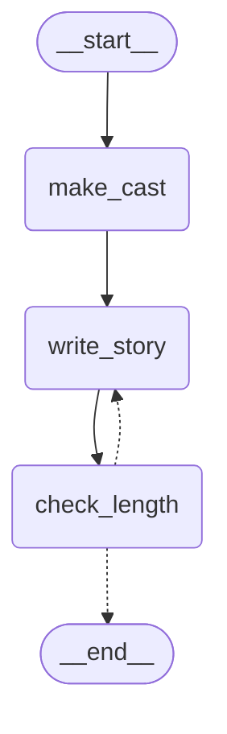

# 第11章 LangGraph入門

第II部では、1回のLLMの呼び出しの質を上げる技術を学んできました。プロンプトの設計（第8章）、サンプリング（第9章）、構造化出力（第10章）です。そして第7章と第8章で、1回の呼び出しでは解決できない問題があることも確かめました。

第III部からは、小説の生成を**複数の工程**に分けていきます。企画を立て、登場人物と世界を設定し、プロットを組み、シーンごとに書き、批評して書き直す。工程が増えると、次のようなことを管理する必要が出てきます。

- どの工程を、どの順番で実行するか
- 工程の結果（登場人物、プロット、本文など）を、どこに持っておき、次の工程にどう渡すか
- 条件によって、次に進むか、前の工程に戻ってやり直すかを切り替える
- 途中で止めて、あとから再開する。人間が途中の結果を確認して直す

これらを自分ですべて書くこともできますが、本書では **LangGraph** というライブラリを使います。この章では、LangGraphの基本を、小さなグラフを作りながら学びます。

## 11.1 LangGraphとは

**LangGraph**は、LLMを使った処理の流れを**グラフ**として組み立てるためのライブラリです。グラフは、次の3つの要素でできています。

| 要素 | 役割 | 小説の生成での例 |
|---|---|---|
| **状態**（State） | すべての工程で共有するデータ | ジャンル、登場人物、本文、書き直した回数 |
| **ノード**（Node） | 状態を受け取って処理し、更新する内容を返す関数 | 登場人物を作る、本文を書く、長さを確かめる |
| **エッジ**（Edge） | ノードからノードへの道筋 | 「登場人物を作ったら、本文を書く」 |

エッジには、いつも同じノードに進む**通常のエッジ**と、状態によって進む先を変える**条件付きエッジ**があります。条件付きエッジを使えば、「長さが足りなければ、書き直しのノードに戻る」のようなループも作れます。

LangGraphを使う利点は、グラフの構造と、各ノードの処理を分けて書けることです。ノードは「状態を受け取って、更新を返す」だけの関数なので、1つずつテストできます。グラフの構造は、図として表示して確かめられます。第17章では、LangGraphの**チェックポイント**の機能を使って、グラフを途中で止めて再開したり、人間が途中の結果を直したりできるようにします。

LangGraphは、同じ開発元のLangChainというライブラリの一部と組み合わせて使われることも多いのですが、本書ではLangChainのLLMの機能は使いません。LLMの呼び出しには、これまで作ってきた `LLMClient` やプロンプト、構造化出力をそのまま使います。LangGraphは、それらを**つなぐ**ためだけに使います。

LangGraphを追加します。

```console
$ uv add langgraph
```

**`pyproject.toml`**（変更）

```diff
     "gguf>=0.19.0",
     "httpx>=0.28.1",
     "jinja2>=3.1.6",
+    "langgraph>=1.2.12",
     "pydantic>=2.13.5",
     "rich>=15.0.0",
     "typer>=0.27.2",
```

## 11.2 最小のグラフ

小説の生成に入る前に、LangGraphの基本的な書き方を、ごく小さな例で確かめます。数を2ずつ増やし、5以上になったら終わる、というだけのグラフです。この例はプロジェクトのファイルには含めないので、試すだけなら、`uv run python` で対話的に入力してください。

```python
import operator
from dataclasses import dataclass
from typing import Annotated, Literal, TypedDict

from langgraph.graph import END, START, StateGraph
from langgraph.runtime import Runtime


class State(TypedDict, total=False):  # ①状態
    n: int
    log: Annotated[list[str], operator.add]


@dataclass
class Context:  # ②実行時に渡すもの
    step: int


def increment(state: State, runtime: Runtime[Context]) -> dict:  # ③ノード
    n = state.get("n", 0) + runtime.context.step
    return {"n": n, "log": [f"{n}になった"]}


def route(state: State) -> Literal["increment", "__end__"]:  # ④条件付きエッジ
    return "increment" if state["n"] < 5 else END


builder = StateGraph(State, context_schema=Context)  # ⑤グラフを組み立てる
builder.add_node("increment", increment)
builder.add_edge(START, "increment")
builder.add_conditional_edges("increment", route, ["increment", END])
graph = builder.compile()

print(graph.invoke({"n": 0}, context=Context(step=2)))  # ⑥実行する
```

実行すると、次のように表示されます。

```text
{'n': 6, 'log': ['2になった', '4になった', '6になった']}
```

順に見ていきましょう。

**①状態**

状態は、`TypedDict` で定義します。`TypedDict` は、「このキーには、この型の値が入る」という辞書の型です。`total=False` を付けると、すべてのキーが揃っていなくてもよくなります。グラフの実行の最初には入力の項目しかなく、ノードが進むにつれて項目が増えていくので、この指定が便利です。

**②実行時に渡すもの**

LLMのクライアントや設定のように、**状態ではないが、ノードが使うもの**は、`context_schema` に指定したクラスで渡します。状態は、ノードが更新していくデータです。一方、実行時に渡すものは、グラフの実行中に変わらない道具です。この2つを分けておくと、状態には純粋なデータだけが残り、あとで保存や再開がしやすくなります（第17章）。

**③ノード**

ノードは、状態を受け取り、**更新したい項目だけ**を辞書で返す関数です。状態全体を返す必要はありません。返した辞書が、LangGraphによって状態に反映されます。2番目の引数に `runtime: Runtime[Context]` を書くと、`runtime.context` で実行時に渡したものを受け取れます。

**リデューサー**

状態の `log` は、`Annotated[list[str], operator.add]` と定義しています。`Annotated` の2番目の値は**リデューサー**と呼ばれ、ノードが返した値を、今の状態の値とどう組み合わせるかを決めます。

- リデューサーがない項目（`n`）：ノードが返した値で**上書き**される
- `operator.add` がリデューサーの項目（`log`）：今の値とノードが返した値を `+` でつなぐ。リストなら、**末尾に追加**される

この例では、`increment` が呼ばれるたびに、`log` に1行ずつ追加されています。

**④条件付きエッジ**

`route` は、状態を見て、次に進むノードの名前を返す関数です。`END` は、グラフの終わりを表す特別な名前（`"__end__"`）です。戻り値の型を `Literal["increment", "__end__"]` のように書いておくと、どのノードに進みうるかが明確になります。

**⑤グラフを組み立てる**

`StateGraph` に状態の型を渡して、ノードとエッジを追加していきます。

- `add_node(名前, 関数)`：ノードを追加する
- `add_edge(A, B)`：AのあとにBに進む。`START` は、グラフの始まりを表す特別な名前
- `add_conditional_edges(A, 関数, 進みうる先)`：Aのあとに関数を呼び、その戻り値のノードに進む

最後に `compile()` を呼ぶと、実行できるグラフになります。このとき、存在しないノードへのエッジがないかなどが確かめられます。

**⑥実行する**

`invoke` に最初の状態と、実行時に渡すものを渡すと、グラフを最後まで実行し、最終的な状態を返します。

## 11.3 小説のグラフを作る

基本がわかったところで、これまでの部品を使って、小説を書くグラフを作ります。第10章の登場人物の生成と、第8章の一発生成を組み合わせ、さらに長さを確かめて、足りなければ書き直すようにします。

```text
START → make_cast → write_story → check_length ─┬→ END
                        ↑                        │
                        └──── 短すぎたら書き直す ─┘
```

| ノード | 処理 | 使う部品 |
|---|---|---|
| `make_cast` | 登場人物を3人作る | 第10章の `generate_structured`、`precise` プロファイル |
| `write_story` | 登場人物をもとに短編を書く。前回の指摘があれば伝える | 第8章のプロンプト、`creative` プロファイル |
| `check_length` | 長さを確かめ、足りなければ指摘を作る | 第7章の `text_stats` |

### 登場人物を使うプロンプト

`write_story` で使うプロンプトを作ります。システムプロンプトは、第8章の一発生成のものと同じにします。

**`prompts/story_with_cast/system.md`**（新規）

```markdown
{# 登場人物を決めてから短編を書く（第11章）。方針は一発生成と同じものを使う #}

```

`` は、Jinja2の**インクルード**です。別のテンプレートの中身をそのまま取り込みます。テンプレートのパスは、第8章の `PromptLibrary` の `FileSystemLoader` に渡したディレクトリ（`prompts/`）からの相対パスです。共通の方針を1か所にまとめておけるので、方針を直すときに1つのファイルを直すだけで済みます。

**`prompts/story_with_cast/user.md`**（新規）

```markdown
次の条件と登場人物で短編小説を書いてください。

# 条件
- ジャンル: {{ genre }}
- 取り入れる要素: {{ tags | join("、") if tags else "自由" }}
- 視点: {{ pov }}
- 長さ: 全体で約{{ length }}字

# 登場人物

- {{ c.name }}（{{ c.reading }}、{{ c.age }}歳、{{ c.role }}）
  - 性格: {{ c.personality }}
  - 口調: {{ c.speech_style }}
  - 目的: {{ c.goal }}
  - 秘密: {{ c.secret }}


# 構成
物語を次の{{ scenes | length }}つの場面に分けて書いてください。場面と場面の間は、空行を1行入れるだけで区切ってください。

{{ loop.index }}. {{ scene.role }}（約{{ scene.chars }}字）: {{ scene.goal }}



# 前回の原稿への指摘
{{ feedback }}

```

第8章の一発生成の指示に、**登場人物**と**前回の原稿への指摘**を加えています。

- `cast` には、第10章の `Character` のリストを渡します。テンプレートの中では、`c.name` のようにPydanticのモデルの属性をそのまま使えます。
- `feedback` は、`check_length` が作る指摘です。1回目の執筆では `None` なので、`` の中は出力されません。

### グラフのモジュール

**`src/novelist/graph/__init__.py`**（新規）

```python
"""LangGraph による生成のパイプライン。"""
```

**`src/novelist/graph/mini.py`**（新規）

```python
"""LangGraph の最小のグラフ：登場人物を決めてから短編を書く（第11章）。

START → make_cast → write_story → check_length ─┬→ END
                        ↑                        │
                        └──── 短すぎたら書き直す ─┘
"""

import operator
from dataclasses import dataclass
from typing import Annotated, Literal, TypedDict

from langgraph.config import get_stream_writer
from langgraph.graph import END, START, StateGraph
from langgraph.graph.state import CompiledStateGraph
from langgraph.runtime import Runtime

from novelist.analysis import text_stats
from novelist.config import Config
from novelist.llm.client import LLMClient
from novelist.llm.structured import generate_structured, schema_text
from novelist.oneshot import clean_story_text, default_structure
from novelist.prompts import PromptLibrary
from novelist.schemas.character import Cast

MIN_RATIO = 0.8  # 目標の文字数の8割に届かなければ書き直す
MAX_ATTEMPTS = 2  # 書く回数の上限


class StoryState(TypedDict, total=False):
    """グラフ全体で共有する状態。"""

    # 入力
    genre: str
    tags: list[str]
    length: int
    # 途中の成果物
    cast: Cast
    text: str
    chars: int
    attempts: int
    feedback: str | None
    # 各ノードの記録（ノードが返したリストが、末尾に追加されていく）
    log: Annotated[list[str], operator.add]


@dataclass
class GraphContext:
    """ノードが使う道具。状態とは別に、実行時に渡す。"""

    client: LLMClient
    prompts: PromptLibrary
    config: Config


def make_cast(state: StoryState, runtime: Runtime[GraphContext]) -> dict:
    """登場人物を作る。"""
    ctx = runtime.context
    messages = ctx.prompts.render(
        "cast", genre=state["genre"], tags=state["tags"], count=3, schema=schema_text(Cast)
    )
    sampling = ctx.config.sampling_for("precise")
    sampling = sampling.model_copy(update={"max_tokens": max(sampling.max_tokens, 4096)})
    cast = generate_structured(ctx.client, messages, Cast, sampling)
    names = "、".join(c.name for c in cast.characters)
    return {"cast": cast, "log": [f"登場人物: {names}"]}


def write_story(state: StoryState, runtime: Runtime[GraphContext]) -> dict:
    """登場人物をもとに短編を書く。前回の指摘があれば、それも伝える。"""
    ctx = runtime.context
    messages = ctx.prompts.render(
        "story_with_cast",
        genre=state["genre"],
        tags=state["tags"],
        length=state["length"],
        pov="三人称",
        cast=state["cast"].characters,
        scenes=default_structure(state["length"]),
        feedback=state.get("feedback"),
    )
    sampling = ctx.config.sampling_for("creative")
    sampling = sampling.model_copy(update={"max_tokens": int(state["length"] * 1.5)})

    # 生成中の文字列を、グラフの外（CLI）へ流す
    writer = get_stream_writer()
    result = ctx.client.stream_chat(messages, sampling, lambda text: writer({"text": text}))

    attempts = state.get("attempts", 0) + 1
    return {
        "text": clean_story_text(result.text),
        "attempts": attempts,
        "log": [f"{attempts}回目の執筆（終了理由: {result.finish_reason}）"],
    }


def check_length(state: StoryState) -> dict:
    """長さを確かめ、足りなければ次の執筆への指摘を作る。"""
    chars = text_stats(state["text"]).chars
    target = state["length"]
    if chars >= target * MIN_RATIO:
        return {"chars": chars, "feedback": None, "log": [f"長さ: {chars}字（合格）"]}
    feedback = (
        f"前回の原稿は{chars}字で、目標の{target}字に足りませんでした。"
        "場面の数と展開は変えずに、各場面の描写と会話を増やしてください。"
    )
    return {"chars": chars, "feedback": feedback, "log": [f"長さ: {chars}字（不足）"]}


def route_after_check(state: StoryState) -> Literal["write_story", "__end__"]:
    """指摘があり、まだ書き直せるなら write_story へ、そうでなければ終わる。"""
    if state.get("feedback") and state.get("attempts", 0) < MAX_ATTEMPTS:
        return "write_story"
    return END


def build_graph() -> CompiledStateGraph:
    """グラフを組み立てる。"""
    builder = StateGraph(StoryState, context_schema=GraphContext)
    builder.add_node("make_cast", make_cast)
    builder.add_node("write_story", write_story)
    builder.add_node("check_length", check_length)
    builder.add_edge(START, "make_cast")
    builder.add_edge("make_cast", "write_story")
    builder.add_edge("write_story", "check_length")
    builder.add_conditional_edges("check_length", route_after_check, ["write_story", END])
    return builder.compile()
```

**`StoryState`**

グラフで共有する状態です。入力（ジャンル、タグ、長さ）、途中の成果物（登場人物、本文、文字数、書いた回数、指摘）、記録（`log`）に分けています。`cast` の型は第10章の `Cast` です。状態には、Pydanticのモデルもそのまま入れられます。

**`GraphContext`**

ノードが使う道具です。`LLMClient`、`PromptLibrary`、`Config` の3つを持たせています。ノードの中で `LLMClient` を作るのではなく外から渡すようにしておくと、テストでは偽のサーバーにつながったクライアントを渡すだけで済みます。

**`make_cast`**

第10章の `cast` コマンドと同じ処理です。プロンプトを展開し、`precise` プロファイルで `generate_structured` を呼びます。返すのは `cast` と `log` の2つだけです。

**`write_story`**

- `story_with_cast` のプロンプトに、状態の登場人物と、前回の指摘を渡します。
- `creative` プロファイルを使い、`max_tokens` は目標の文字数の1.5倍にします（第7章）。
- `get_stream_writer()` は、ノードの中から、グラフの外へ任意のデータを流すための関数です。第6章の `stream_chat` の `on_text` で、生成された文字列を `{"text": ...}` という辞書にして流します。こうすると、グラフを実行しているCLIの側で、生成中の本文を表示できます（11.4節）。
- `attempts`（書いた回数）を1増やします。状態の値は `state.get("attempts", 0)` のように、まだない場合の値を指定して読みます。

**`check_length`**

本文の文字数が、目標の8割（`MIN_RATIO`）に届いているかを確かめます。足りなければ、具体的な文字数を入れた指摘を `feedback` に入れ、届いていれば `None` にします。このノードはLLMを使わないので、`runtime` 引数を省略しています。LangGraphは、関数の引数を見て、`runtime` が必要かどうかを判断します。

**`route_after_check`**

`check_length` のあとの条件付きエッジです。指摘があり、まだ書き直せる（`attempts` が `MAX_ATTEMPTS` 未満）なら `write_story` に戻り、そうでなければ終わります。書き直しの回数に上限を設けているのは、LLMがどうしても目標の長さに届かない場合に、無限にループしないようにするためです。**ループを作るときは、必ず抜け出す条件を用意する**ことが大切です。

**`build_graph`**

11.2節と同じ手順で、ノードとエッジを追加してグラフを組み立てます。

なお、本文を短い場合に丸ごと書き直すのは、効率のよい方法ではありません。第III部では、シーンごとに書き、批評して必要なところだけを直す方法に改良していきます。この章の目的は、LangGraphでループを作る方法を学ぶことです。

## 11.4 グラフを実行するコマンド

`cli.py` に、このグラフを実行する `mini` コマンドを追加します。まず import を追加します。

**`src/novelist/cli.py`**（変更）

```diff
 from novelist import __version__
 from novelist.analysis import text_stats
 from novelist.config import DEFAULT_CONFIG_PATH, Config, SamplingConfig, load_config
+from novelist.graph.mini import GraphContext, build_graph
 from novelist.llm.chat_template import render_chat_template
 from novelist.llm.client import LLMClient, LLMError, Message
 from novelist.llm.gguf_info import read_gguf_info
```

ファイルの末尾に `mini` コマンドを追加します。

**`src/novelist/cli.py`**（変更）

```diff
         out.parent.mkdir(parents=True, exist_ok=True)
         out.write_text(result.model_dump_json(indent=2), encoding="utf-8")
         console.print(f"保存先: {out}")
+
+
+@app.command()
+def mini(
+    ctx: typer.Context,
+    genre: Annotated[str, typer.Option("--genre", "-g", help="ジャンル")] = "ミステリー",
+    tags: Annotated[str, typer.Option("--tags", "-t", help="取り入れる要素（カンマ区切り）")] = "",
+    length: Annotated[int, typer.Option("--length", "-l", help="目標の文字数")] = 3000,
+    out_dir: Annotated[Path, typer.Option("--out-dir", help="保存先のディレクトリ")] = Path(
+        "works/mini"
+    ),
+    show_graph: Annotated[
+        bool, typer.Option("--show-graph", help="グラフの構造をMermaidで表示して終わる")
+    ] = False,
+) -> None:
+    """登場人物を決めてから短編を書く、最小のグラフを実行します（第11章）。"""
+    graph = build_graph()
+    if show_graph:
+        console.print(graph.get_graph().draw_mermaid(), markup=False, highlight=False)
+        return
+
+    config = _load_config(ctx)
+    tag_list = [tag.strip() for tag in tags.split(",") if tag.strip()]
+    inputs = {"genre": genre, "tags": tag_list, "length": length}
+
+    try:
+        with LLMClient(config.server) as client:
+            context = GraphContext(
+                client=client, prompts=PromptLibrary(config.prompts_dir), config=config
+            )
+            state = dict(inputs)
+            for mode, chunk in graph.stream(
+                inputs, context=context, stream_mode=["updates", "custom"]
+            ):
+                if mode == "custom":
+                    # write_story ノードから流れてくる、生成中の文字列
+                    console.print(chunk["text"], end="", markup=False)
+                    continue
+                for node, update in chunk.items():
+                    state.update({k: v for k, v in update.items() if k != "log"})
+                    console.print()
+                    for line in update.get("log", []):
+                        console.rule(f"[cyan]{node}[/cyan]: {line}")
+    except (LLMError, PromptError) as e:
+        console.print(str(e), style="red", markup=False)
+        raise typer.Exit(1) from e
+
+    path = out_dir / f"{datetime.now():%Y%m%d-%H%M%S}.md"
+    meta = {
+        "genre": genre,
+        "tags": ", ".join(tag_list),
+        "target_length": length,
+        "cast": ", ".join(f"{c.name}（{c.role}）" for c in state["cast"].characters),
+        "attempts": state["attempts"],
+    }
+    write_story(path, meta, state["text"])
+    console.print(f"保存先: {path}")
```

**`--show-graph`**

`graph.get_graph().draw_mermaid()` で、グラフの構造を**Mermaid**という図の記法で出力します。Mermaidは、GitHubやVS Codeの拡張機能など、多くのツールで図として表示できます。

**`graph.stream`**

11.2節の `invoke` は、グラフを最後まで実行してから、最終的な状態を返しました。`stream` を使うと、実行の途中の出来事を1つずつ受け取れます。`stream_mode` には、受け取りたい出来事の種類を指定します。

| 種類 | 受け取る内容 |
|---|---|
| `"updates"` | ノードが終わるたびに、`{ノード名: そのノードが返した更新}` |
| `"custom"` | ノードの中で `get_stream_writer()` で流したデータ |

`stream_mode` にリストで複数の種類を指定すると、`(種類, 内容)` の組で受け取れます。

- `"custom"` のときは、`write_story` が流した生成中の文字列を、そのまま表示します。
- `"updates"` のときは、ノードの `log` を区切り線として表示し、更新の内容を手元の `state` 辞書に反映しておきます。グラフの最終的な状態は `stream` からは直接返らないので、こうして自分で組み立てています（`log` は表示するだけなので、反映しません）。

最後に、第7章の `write_story`（`story_file.py` の関数）で、本文を登場人物の情報と一緒に保存します。グラフのノードにも `write_story` という名前がありますが、`cli.py` ではノードの関数を import していないので、名前がぶつかることはありません。

### 動かしてみる

まず、グラフの構造を確かめます。

```console
$ uv run novelist mini --show-graph
---
config:
  flowchart:
    curve: linear
---
graph TD;
	__start__([<p>__start__</p>]):::first
	make_cast(make_cast)
	write_story(write_story)
	check_length(check_length)
	__end__([<p>__end__</p>]):::last
	__start__ --> make_cast;
	check_length -.-> __end__;
	check_length -.-> write_story;
	make_cast --> write_story;
	write_story --> check_length;
	classDef default fill:#f2f0ff,line-height:1.2
	classDef first fill-opacity:0
	classDef last fill:#bfb6fc
```

これをMermaidに対応したツールで表示すると、次のような図になります。実線（`-->`）が通常のエッジ、点線（`-.->`）が条件付きエッジです。



グラフを実行します。

```console
$ uv run novelist mini -t 鉄道,冬 -l 3000
─────────────── make_cast: 登場人物: 沢渡透、三枝葉子、黒川源三 ────────────────
霧の終着駅

ストーブの上で薬缶が鳴っていた。窓の外は白く塗りつぶされ、……
……（中略）……
「切符は、最初からなかったんですね」沢渡は言った。
────────────────── write_story: 1回目の執筆（終了理由: stop） ──────────────────

────────────────────── check_length: 長さ: 2186字（不足） ───────────────────────
霧の終着駅

ストーブの上で薬缶が鳴っていた。……
……（中略）……
黒川は黙って帽子を取った。
────────────────── write_story: 2回目の執筆（終了理由: stop） ──────────────────

────────────────────── check_length: 長さ: 2894字（合格） ───────────────────────
保存先: works/mini/20260927-093042.md
```

登場人物が決まり、本文が生成されながら表示され、長さが足りなかったので指摘を受けてもう一度書き直した様子がわかります。

保存したファイルのメタデータには、登場人物と書いた回数が記録されています。

```markdown
---
genre: ミステリー
tags: 鉄道, 冬
target_length: 3000
cast: 沢渡透（主人公）, 三枝葉子（相棒）, 黒川源三（敵対者）
attempts: 2
---

霧の終着駅
……
```

第8章の一発生成と比べて、登場人物の名前や口調が途中で変わることは減ったはずです。登場人物を先に決め、その設定を執筆の指示に含めたからです。**先に決めたことを、あとの工程の入力にする**。これが、第III部の多段パイプラインの基本的な考え方です。

※ 上の出力は例です。実際の登場人物や本文、長さは、モデルや設定によって異なります。

## 11.5 テストを書く

### 偽のサーバーをストリーミングに対応させる

`write_story` は、第6章の `stream_chat` でストリーミングの応答を受け取ります。第10章の `ChatRecorder` は、ストリーミングでない応答しか返せなかったので、リクエストの `stream` が `true` のときは、SSEの形式で返すようにします。

**`tests/conftest.py`**（変更）

```diff
         body = json.loads(request.content)
         self.requests.append(body)
         content = self.contents.pop(0)
+        if body.get("stream"):
+            # ストリーミングのときは、SSEの形式で1回にまとめて返す
+            return httpx.Response(
+                200,
+                headers={"Content-Type": "text/event-stream"},
+                content=_sse(
+                    {"choices": [{"delta": {"content": content}}]},
+                    {"choices": [{"delta": {}, "finish_reason": self.finish_reason}]},
+                ),
+            )
         return httpx.Response(
             200,
             json={
```

`_sse` は、第6章で `fake_llama_server` のために作った関数です。

### グラフのテスト

**`tests/test_graph_mini.py`**（新規）

```python
import json
from pathlib import Path

from conftest import CAST_DATA, ChatRecorder
from langgraph.graph import END

from novelist.config import Config
from novelist.graph.mini import GraphContext, build_graph, check_length, route_after_check
from novelist.llm.client import LLMClient
from novelist.prompts import PromptLibrary

PROJECT_PROMPTS = Path(__file__).parent.parent / "prompts"
CONFIG = Config.model_validate(
    {"profiles": {"precise": {"temperature": 0.3}, "creative": {"temperature": 1.0}}}
)


def test_check_length() -> None:
    short = check_length({"text": "雪" * 50, "length": 100})
    assert short["chars"] == 50
    assert "100字に足りません" in short["feedback"]
    enough = check_length({"text": "雪" * 90, "length": 100})
    assert enough["feedback"] is None


def test_route_after_check() -> None:
    assert route_after_check({"feedback": "短い", "attempts": 1}) == "write_story"
    assert route_after_check({"feedback": "短い", "attempts": 2}) == END  # 上限に達した
    assert route_after_check({"feedback": None, "attempts": 1}) == END


def test_graph_rewrites_short_story() -> None:
    server = ChatRecorder(
        [
            json.dumps(CAST_DATA, ensure_ascii=False),  # make_cast
            "霧の駅\n\n" + "雪" * 50,  # write_story（1回目: 短すぎる）
            "霧の駅\n\n" + "雪" * 100,  # write_story（2回目）
        ]
    )
    with LLMClient(Config().server, transport=server.transport) as client:
        context = GraphContext(client=client, prompts=PromptLibrary(PROJECT_PROMPTS), config=CONFIG)
        state = build_graph().invoke(
            {"genre": "ミステリー", "tags": ["鉄道"], "length": 100}, context=context
        )

    assert state["attempts"] == 2
    assert state["chars"] == 103  # タイトル3文字 + 本文100文字
    assert state["feedback"] is None
    # ノードごとの記録が、実行した順に追加されている
    assert [line.split(":")[0] for line in state["log"]] == [
        "登場人物",
        "1回目の執筆（終了理由",
        "長さ",
        "2回目の執筆（終了理由",
        "長さ",
    ]
    # 2回目の執筆の指示には、1回目への指摘が含まれている
    second_write = server.requests[2]["messages"][-1]["content"]
    assert "前回の原稿は53字" in second_write
    # 登場人物の設定が、執筆の指示に含まれている
    assert "沢渡透" in server.requests[1]["messages"][-1]["content"]


def test_graph_streams_text() -> None:
    server = ChatRecorder([json.dumps(CAST_DATA, ensure_ascii=False), "霧の駅\n\n" + "雪" * 100])
    with LLMClient(Config().server, transport=server.transport) as client:
        context = GraphContext(client=client, prompts=PromptLibrary(PROJECT_PROMPTS), config=CONFIG)
        events = list(
            build_graph().stream(
                {"genre": "SF", "tags": [], "length": 100},
                context=context,
                stream_mode=["updates", "custom"],
            )
        )
    custom = [chunk for mode, chunk in events if mode == "custom"]
    assert custom == [{"text": "霧の駅\n\n" + "雪" * 100}]
    nodes = [next(iter(chunk)) for mode, chunk in events if mode == "updates"]
    assert nodes == ["make_cast", "write_story", "check_length"]
```

- **`test_check_length` と `test_route_after_check`**：LLMを使わないノードと、条件付きエッジの関数は、ふつうの関数としてテストできます。状態は辞書なので、必要な項目だけを入れた辞書を渡せば十分です。
- **`test_graph_rewrites_short_story`**：グラフ全体を実行します。`ChatRecorder` に、登場人物のJSON、短すぎる本文、十分な長さの本文の3つを用意しておくと、1回目の執筆のあとに `check_length` が不足と判断し、2回目の執筆に進むはずです。最終的な状態の `attempts` と `log`、2回目の執筆の指示に指摘が含まれていることを確かめています。
- **`test_graph_streams_text`**：`stream` で、`"custom"` として本文が流れてくること、`"updates"` がノードの順番どおりに届くことを確かめています。

テスト用の `Config` には、`make_cast` と `write_story` が使う `precise` と `creative` のプロファイルを定義しています。

### CLIのテスト

第8章の `write_config` に `precise` プロファイルを追加し、第10章の `test_cast` で個別に追加していた部分を削除します。そのうえで、`mini` コマンドのテストを追加します。

**`tests/test_cli.py`**（変更）

```diff
     """プロジェクトの prompts/ を使う設定ファイルを作る。"""
     path = tmp_path / "novelist.toml"
     path.write_text(
-        f"prompts_dir = '{PROJECT_PROMPTS.as_posix()}'\n\n[profiles.creative]\ntemperature = 1.0\n",
+        f"prompts_dir = '{PROJECT_PROMPTS.as_posix()}'\n\n"
+        "[profiles.creative]\ntemperature = 1.0\n\n"
+        "[profiles.precise]\ntemperature = 0.3\n",
         encoding="utf-8",
     )
     return path
```

```diff
         "novelist.cli.LLMClient", lambda s: LLMClient(s, transport=server.transport)
     )
     config = write_config(tmp_path)
-    (tmp_path / "novelist.toml").write_text(
-        config.read_text(encoding="utf-8") + "\n[profiles.precise]\ntemperature = 0.3\n",
-        encoding="utf-8",
-    )
     out = tmp_path / "cast.json"
     result = runner.invoke(app, ["--config", str(config), "cast", "-c", "3", "-o", str(out)])
     assert result.exit_code == 0
```

```diff
     result = runner.invoke(app, ["cast", "--show-schema"])
     assert result.exit_code == 0
     assert '"reading"' in result.output
+
+
+def test_mini(monkeypatch: pytest.MonkeyPatch, tmp_path: Path) -> None:
+    story = "霧の駅\n\n" + "雪が降っていた。" * 20
+    server = ChatRecorder([json.dumps(CAST_DATA, ensure_ascii=False), story])
+    monkeypatch.setattr(
+        "novelist.cli.LLMClient", lambda s: LLMClient(s, transport=server.transport)
+    )
+    config = write_config(tmp_path)
+    out_dir = tmp_path / "mini"
+    args = ["--config", str(config), "mini", "-l", "100", "--out-dir", str(out_dir)]
+    result = runner.invoke(app, args)
+    assert result.exit_code == 0
+    assert "make_cast" in result.output
+    assert "雪が降っていた。" in result.output  # ストリーミングで表示された本文
+    content = next(out_dir.glob("*.md")).read_text(encoding="utf-8")
+    assert "attempts: 1" in content
+    assert "沢渡透（主人公）" in content
+
+
+def test_mini_show_graph() -> None:
+    result = runner.invoke(app, ["mini", "--show-graph"])
+    assert result.exit_code == 0
+    assert "check_length -.-> write_story" in result.output
```

テストを実行します。

```console
$ uv run pytest
...
============================== 85 passed in 0.80s ==============================
$ uv run ruff check
All checks passed!
```

### コミットする

```console
$ git add .
$ git commit -m "第11章: LangGraph入門（登場人物を決めてから書く最小のグラフ）"
```

この章で追加・変更したファイルは次のとおりです。

```text
novelist/
├── pyproject.toml                # 変更: langgraph を追加
├── prompts/
│   └── story_with_cast/          # 新規
│       ├── system.md
│       └── user.md
├── src/
│   └── novelist/
│       ├── cli.py                # 変更: mini を追加
│       └── graph/                # 新規
│           ├── __init__.py
│           └── mini.py
└── tests/
    ├── conftest.py               # 変更
    ├── test_cli.py               # 変更
    └── test_graph_mini.py        # 新規
```

## 11.6 まとめ

- **LangGraph**は、LLMを使った処理の流れを、**状態**・**ノード**・**エッジ**からなるグラフとして組み立てるライブラリです
- 状態は `TypedDict` で定義し、ノードは**更新したい項目だけ**を返します。**リデューサー**（`operator.add` など）を指定した項目は、上書きではなく追加されます
- LLMのクライアントのような道具は、状態ではなく**実行時に渡すもの**（`context_schema`）として渡します
- **条件付きエッジ**で、状態に応じて進む先を変えられます。ループを作るときは、必ず抜け出す条件を用意します
- `stream` と `get_stream_writer()` で、ノードの中で生成中の文字列を、CLIで表示できます
- 登場人物を決め、その設定を執筆の指示に含め、長さが足りなければ書き直す `novelist mini` を作りました

これで第II部は終わりです。1回の呼び出しの質を上げる技術と、工程をつなぐ仕組みが揃いました。

次の第III部では、いよいよ本格的な多段パイプラインを作ります。第12章では、ジャンルと好みのタグから企画案を複数出し、その中から選ぶ工程を作ります。
